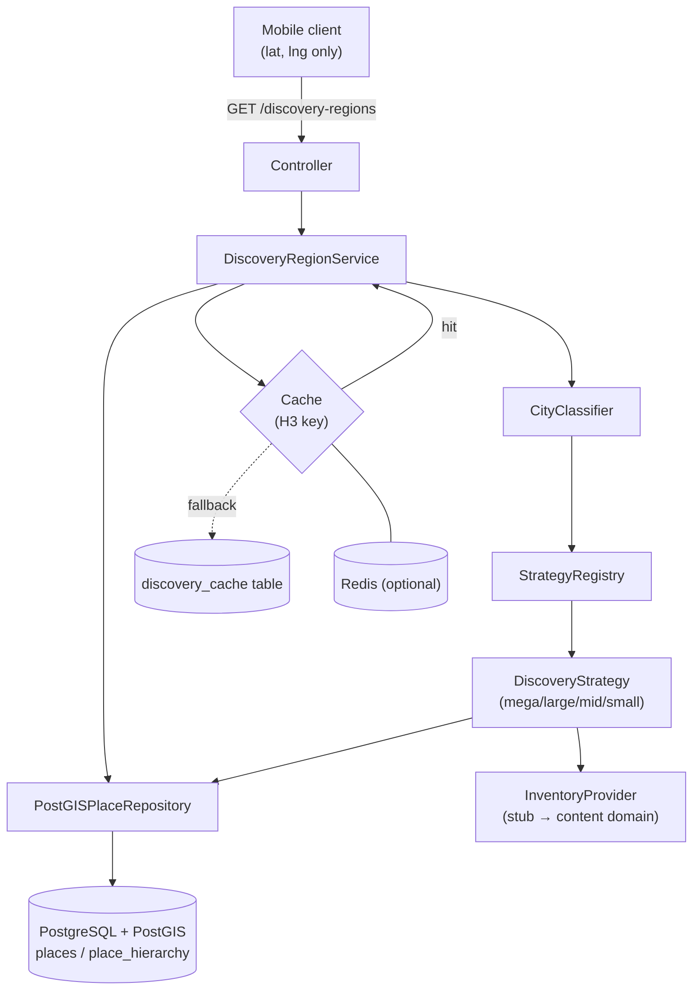

# Location Discovery Service

Production-grade geospatial discovery for the comedy app. Replaces the legacy
population-density-tile heuristic with a normalized place hierarchy, a
Strategy-pattern discovery engine, inventory-aware scoring, and a layered cache.

The frontend stays geographically ignorant: it sends only `{ lat, lng }` and the
backend makes every geographic decision.

## Architecture



Flow: resolve containing city (`ST_Contains`, nearest-city fallback) → classify
by population/market size → select strategy → strategy queries children
(boroughs/neighbourhoods) or nearby cities and consults inventory → cache and
return.

## Module layout

```
backend/
  alembic/                     # Alembic env + versioned migrations
  src/
    main.py                    # FastAPI app factory
    shared/
      config.py                # pydantic-settings (DISCOVERY_ prefix)
      database/engine.py       # SQLAlchemy engine/session
      cache/                   # CacheBackend, Memory, Redis, H3 keys, factory
    location/
      controller.py            # GET /discovery-regions
      service.py               # orchestration + caching
      repository.py            # PostGIS queries (Protocol + Empty + PostGIS impls)
      classifier.py            # population → market size
      scoring.py               # inventory sufficiency signal
      inventory.py             # InventoryProvider (StubInventoryProvider for now)
      schemas.py               # API Pydantic models (extended scopeType)
      strategies/              # Strategy pattern: mega/large/mid/small + registry
      models/                  # ORM (orm.py) + domain dataclasses (domain.py)
      ingest.py                # full-hierarchy OSM ingest
  tests/
```

## Database schema

- `places` — id, name, `type` (country/region/metro/city/borough/neighbourhood),
  country_code, parent_id, population, market_size, `h3_index`,
  `boundary geometry(MultiPolygon,4326)`, `center geometry(Point,4326)`.
  GIST indexes on `boundary` and `center`; btree on `h3_index`, `type`, `parent_id`.
- `place_hierarchy` — closure table (`ancestor_id`, `descendant_id`, `depth`) for
  O(1) subtree/ancestor lookups at any depth.
- `discovery_cache` — durable cache fallback (`cache_key`, `scope_type`, `payload`,
  `expires_at`) surviving process restarts and Redis loss.

Managed by Alembic (`0001_place_hierarchy`); Supabase SQL migrations retain
auth/RLS ownership. `0002_migrate_legacy` backfills from the old
`cities`/`neighbourhoods` tables and drops the density-tile schema.

## Spatial indexing tradeoffs

- **PostGIS polygon containment (`ST_Contains` + GIST)** — authoritative
  city resolution; chosen as the source of truth.
- **KNN (`<->`) nearest-city** — fast fallback when a point falls outside all
  boundaries (coastlines, gaps, un-ingested areas).
- **H3** — used for cache-key generation (snapping nearby requests to one cell,
  resolution configurable via `DISCOVERY_CACHE_H3_RESOLUTION`) and stored per
  place for future content co-location (`content.h3_index` in PremiumBackend).

## API contract

`GET /discovery-regions?lat={lat}&lng={lng}`

```json
{
  "scopeType": "borough_cluster | neighbourhood_cluster | city_cluster | nearby_cities",
  "regions": [
    {
      "id": "…",
      "name": "…",
      "type": "city | borough | neighbourhood | …",
      "center": { "lat": 0, "lng": 0 }
    }
  ]
}
```

## Caching

Two tiers behind `CacheBackend`: Redis (optional, via `DISCOVERY_REDIS_URL`) with
an in-process `MemoryCache` fallback, plus the durable `discovery_cache` table.
Keys are H3 cells so adjacent coordinates share cache entries. TTL via
`DISCOVERY_CACHE_TTL_SECONDS` (default 300s).

## Failure handling

- No DB configured → `EmptyPlaceRepository` returns empty results (200, no crash).
- Point outside all boundaries → nearest-city KNN fallback.
- Redis unavailable → automatic degrade to `MemoryCache`; writes still succeed
  locally.
- Thin local inventory (mid-sized cities) → widen from neighbourhoods to nearby
  cities so feeds are never sparse.

## Scalability

- Read-heavy path is cache-first; H3 keying collapses request fan-out.
- Closure table keeps hierarchy traversals index-only regardless of depth.
- Repository is a `Protocol`; the service and strategies have no DB coupling, so
  the module lifts cleanly into a standalone Location service (PremiumBackend
  future state) behind an API gateway.
- Inventory is abstracted (`InventoryProvider`); the content domain swaps in a
  real provider without touching discovery logic.

## Operations

```bash
# From backend/
alembic upgrade head                 # apply schema (needs DISCOVERY_DATABASE_URL)
discovery-ingest --cities "London:gb,New York:us"   # populate the hierarchy
pytest tests/                        # unit tests (no DB required)
uvicorn main:app --app-dir src       # run the API
```

Environment (prefix `DISCOVERY_`): `DATABASE_URL`, `REDIS_URL`,
`CACHE_TTL_SECONDS`, `CACHE_H3_RESOLUTION`, `MEGA_CITY_POPULATION`,
`LARGE_CITY_POPULATION`, `MID_CITY_POPULATION`, `NEARBY_CITY_RADIUS_KM`,
`MIN_INVENTORY_FOR_NEIGHBOURHOODS`.
